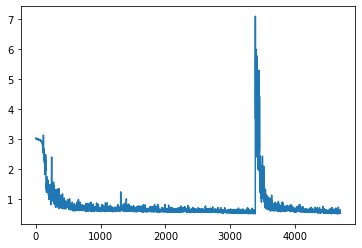

# Assignment 2.5 - MNIST classification and addition

Recognize MNIST digit
Add a random number and infer the sum

---------

# Approach

### Model inputs:

1. MNIST image
2. Random number

### Problem approach

The problem is approached in two parts. 
1. multi-class classification of the MNIST input image which has ```0-9``` = 10 numbers to be classified
2. multi-label classification of the sum of the MNIST digit and the random number represented as a 5 digit binary encoded number

### Data representation

1. MNIST is provided as per the Pytorch MNIST dataset
2. Random number is provided as a one hot encoded input (10 values - 0-9)

### Data generation strategy

Class ```MNIST_add_dataset``` derived from Dataset is defined as a custom dataset to generate the inputs

Random number list is generated and converted to one hot encoding.

The sum is computed from addition of the MNIST label and the random number for each case, and then encoded into a binary format.
As the sum values can range from 0-19, a 5 digit binary encoding is sufficient.

The target is the MNIST number label concatenated with the 5 digit binary representation of the sum.

``` 
class MNIST_add_dataset(Dataset):
  def __init__(self, trainset=True):
    mnist_set <- MNIST dataset
    num_onehot <- one hot encoding of random numbers generated
    digit_list <- MNIST digit labels
    bin_sum_list <- binary representation of the num of the MNIST and random number lists
    target <- MNIST label concatenated with the 5 digit sum binary encoding
  def __getitem__(self, index):
    # MNIST image
    image = self.mnist_set[index][0]
    # One hot encoding of the random number
    oh_num = torch.as_tensor(self.num_onehot[index],dtype=torch.float32)
    # concatenated target
    target = torch.tensor(self.target[index])
    return ([image, oh_num],target)        
  def __len__(self):
    return len(self.mnist_set)
```

### Model definition and inputs processing

The model consists of:
- 3 convolutional blocks for getting the features from the input image, 
- followed by 3 linear blocks which take a combined input consisting of concatenated output from the Conv layers and the one hot encoded random number
- ReLU activation in between. 

``` 
Model(
  (conv1): Sequential(
    (0): Conv2d(1, 16, kernel_size=(5, 5), stride=(1, 1))
    (1): ReLU()
    (2): MaxPool2d(kernel_size=2, stride=2, padding=0, dilation=1, ceil_mode=False)
  )
  (conv2): Sequential(
    (0): Conv2d(16, 32, kernel_size=(5, 5), stride=(1, 1))
    (1): ReLU()
    (2): MaxPool2d(kernel_size=2, stride=2, padding=0, dilation=1, ceil_mode=False)
  )
  (conv3): Sequential(
    (0): Conv2d(32, 10, kernel_size=(3, 3), stride=(1, 1))
    (1): MaxPool2d(kernel_size=2, stride=2, padding=0, dilation=1, ceil_mode=False)
  )
  (relu): ReLU()
  (fc1): Linear(in_features=20, out_features=60, bias=True)
  (fc2): Linear(in_features=60, out_features=30, bias=True)
  (fc3): Linear(in_features=30, out_features=15, bias=True)
)
```

### Output layer Activation and losses

As per the problem approach, there are 2 classifications happening. 

1. For MNIST classification, log_softmax activation is used for the first 10 output nodes as it provides good numerical accuracy. 
NLL (negative log likelihood) loss is considered to be used with this activation.
2. For the multi-label sum (5 digit binary) a Sigmoid activation is used. I have used a Hardsigmoid function here as it is more sharper and gives a better range for small outputs. I have used the Binary coded entropy (BCE loss) as the loss function due to the multi-label output.

[model picture TODO]

### Train function

Highlights of the train function.

```
def train(model, device, train_loader, optimizer, epoch, losses):
    print(f"EPOCH - {epoch}")
    model.train()
    for batch_idx, (input, target) in enumerate(train_loader):
        image, number, target = input[0].to(device), input[1].to(device), target.to(device)
        # clear the grad computation
        optimizer.zero_grad()
        y_pred = model(image, number)  # Passing batch
        
        # Calculate loss
        # using 2 losses - one for the MNIST prediction and one for the sum (binary)
        # using Negative log likelihood for the MNIST prediction as we used Log Softmax for the activation
        loss_nll = nn.NLLLoss()
        loss1 = loss_nll(y_pred[:,:10],target[:,0])
        
        # Using Binary cross entropy for the binary sum representation
        loss_bce = nn.BCELoss()
        loss2 = loss_bce(y_pred[:,10:].float(),target[:,1:].float())

        # Total loss
        loss=loss1+loss2
        
        # Backpropagation
        loss.backward()
        optimizer.step()
```

### Training and validation

Model was trained on GPU for 20 epochs with a batch size of 256. At the end of 20 epochs the test accuracy for MNIST was 98%, for the sum prediction was 92% and overall accuracy was 91%.

```
EPOCH - 0
 Train Epoch: 1/20             [51200/60000 (85%)]            	Avg Loss: 0.004698
Test set: Average loss: 0.0042,         Accuracy-MNIST: 9073/10000 (91%)	        Accuracy-sum: 4749/10000 (47%)	        Accuracy-total: 4547/10000 (45%)

EPOCH - 1
 Train Epoch: 2/20             [51200/60000 (85%)]            	Avg Loss: 0.002582
Test set: Average loss: 0.0030,         Accuracy-MNIST: 9634/10000 (96%)	        Accuracy-sum: 6459/10000 (65%)	        Accuracy-total: 6270/10000 (63%)

EPOCH - 2
 Train Epoch: 3/20             [51200/60000 (85%)]            	Avg Loss: 0.002450
Test set: Average loss: 0.0029,         Accuracy-MNIST: 9731/10000 (97%)	        Accuracy-sum: 7042/10000 (70%)	        Accuracy-total: 6902/10000 (69%)

...

EPOCH - 18
 Train Epoch: 19/20             [51200/60000 (85%)]            	Avg Loss: 0.002461
Test set: Average loss: 0.0023,         Accuracy-MNIST: 9862/10000 (99%)	        Accuracy-sum: 8442/10000 (84%)	        Accuracy-total: 8338/10000 (83%)

EPOCH - 19
 Train Epoch: 20/20             [51200/60000 (85%)]            	Avg Loss: 0.002242
Test set: Average loss: 0.0022,         Accuracy-MNIST: 9845/10000 (98%)	        Accuracy-sum: 9218/10000 (92%)	        Accuracy-total: 9093/10000 (91%)
```
### Losses plot



# Conclusion

Addition is a liner problem. Combining MNIST classification with addition provided many challenges in understanding how to structure the network (with convolutional
and linear units) and defining the loss functions. 
Note: The accuracy obtained is quite good and I am trying to make sure it is correct.

