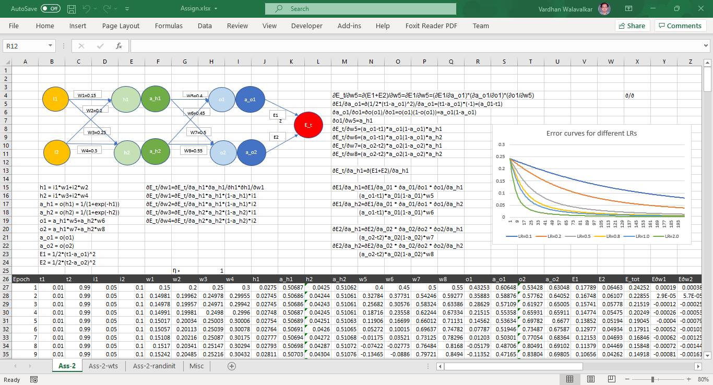
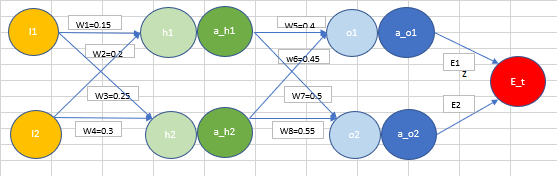
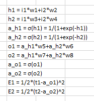
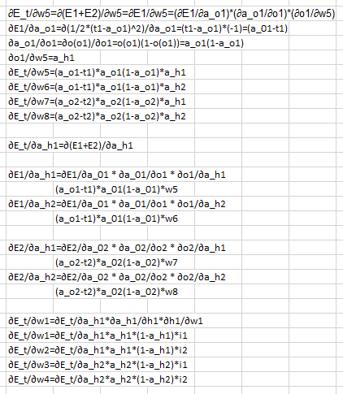
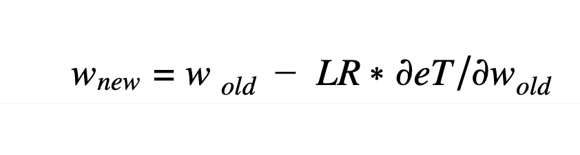
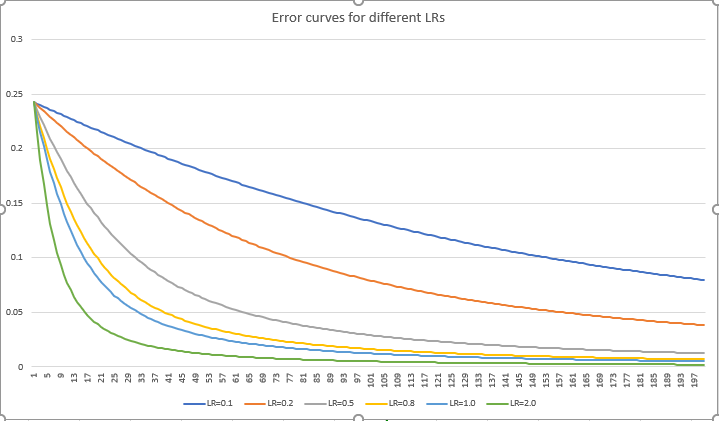
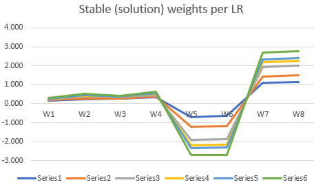
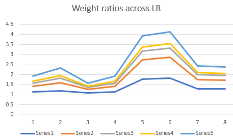

# Assignment 2
The excel screenshot is shown below.

### Network architecture 
The network architecture and the initial weights are fixed as follows (as per the assignment):

### Forward and back propagation formulae
The formulae for forward and back propagation are described in the excel sheet Ass-2.

The forward formulae are:

The formulae for backpropagation based on partial derivatives of the error wrt the different weights are as follows:

The formulae are implemented from row 27 onwards. 
The backpropagation formulae are derived using the chain rule by following the propagation paths backwards using the chain rule.

### Weight updates 
The weights are updated as per the BP formulae using the equation:

The initial weights are as per the assignment.

### Learning
* the formulae for forward propagation and back propagation are incorporated in the excel
* from the second row onwards, the weight updation formulae are used

### Error curves
The error curves for different learning rates (LR) (0.1, 0.2, 0.5, 0.8, 1, 2) are plotted in the following graph:

### Analysis
It is noticed that as the LR is increased the weights converge to the final values faster. Also it is seen that there is no divergence even if the LR is increased to larger values, in fact even values beyond 100 converge quickly (but if the LR exceeds some very large value e.g. 10^6 the network does not converge). This may be due to the nature of this problem which could probably have a quadratic error surface (in 8D corresponding to 8 weights) with a large region of global minima.

## Additional analysis

I tried to see if the converged final stable weights are the same for different LRs (sheet Ass-2-wts) - they seem to be different but follow a similar pattern (in terms of the ratios of the different weights for a sample solution (for an LR)). 

In the above figure the Series1-series6 are the LRs from 0.1 to 2.0.

Also the final total error always tends to zero. The ratios of the final stable weights across LR seems to also follow a pattern. 

This seems to indicate that the error surface has a global minimum spread along either a linear or a quadratic "line" (n 8D space) and each LR results in a minimum along some point in this line.

I also tried to start with different (random) weights each time and see if the weights converge to same values for each LR. A few samples for this are seen in the excel sheet Ass-2-randinit.
It seems like irrespective of the initial weights the final weights tend to be close to an "ideal" weight distribution.
