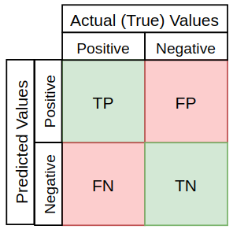
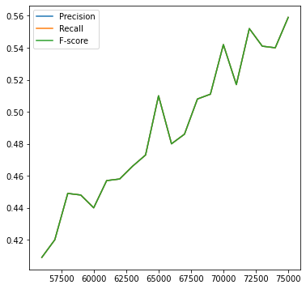
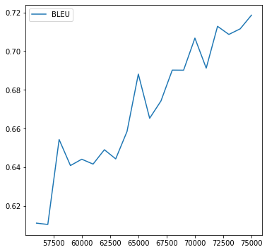
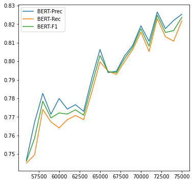
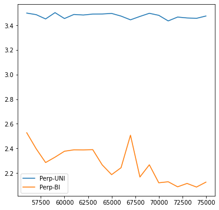

# TSAI Assignment 7
## Description

'Pick any of your past code and:

    Implement the following metrics (either on separate models or same, your choice):
        Recall, Precision, and F1 Score
        BLEU 
        Perplexity (explain whether you are using bigram, trigram, or something else, what does your PPL score represent?)
        BERTScore (here are 1 (Links to an external site.) 2 (Links to an external site.) examples)
    Once done, proceed to answer questions in the Assignment-Submission Page. 

    Questions asked are:
        Share the link to the readme file where you have explained all 4 metrics. 
        Share the link(s) where we can find the code and training logs for all of your 4 metrics
        Share the last 2-3 epochs/stage logs for all of your 4 metrics separately (A, B, C, D) and describe your understanding of the numbers you're seeing, are they good/bad? Why?'
        
## Solution
I have used the Encoder-Decoder with Attention model used for languge translation [1] model from previous assignments, and the correspondign colab implementaton from [2]. A definition of the applicable metrics for this assignment follows. The implementation of the metrics is also described.

## Metrics
### Precision, Recall, & F1 score
To understand these we need to understand the True positives, False positves, True negatives and False negatives, which are shown in the following Confusion matrix.

.

Based on TP, FP, TN and FN, the following metrics are defined as:

#### Precision

Precision is a measure of how many of the positive predictions (TP + FP) are made correctly (TP).

#### Recall

Recall is a measure of how many of the positive cases the classifier correctly predicted (TP), over all the positive cases in the data (TP + FN).

#### F1 score

The F1 score is a measure combining Precision and Recall and is a harmonic mean of them.

#### Approach

For all metrics a list of the target (correct) tranlsated sentences and of the predicted sentences was made.

For getting these scores I classified each target translation as a positive or a negative randomly. When the predicted translation matched (or not) I marked it as True (or False). The P, R and F1 scores are based on this.

### BLEU score

The BLEU (BiLingual Evaluation Understanding) score introduced in [4] is an algorithm for evaluating the quality of text which has been machine-translated from one natural language to another. Scores are calculated for individual translated segments—generally sentences—by comparing them with a set of good quality reference translations. Those scores are then averaged over the whole corpus to reach an estimate of the translation's overall quality.

The BLEU score is a number between zero and one that measures the similarity of the machine-translated text to a set of high quality reference translations. A value of 0 means that the machine-translated output has no overlap with the reference translation (low quality) while a value of 1 means there is perfect overlap with the reference translations (high quality).

The computation is based on comparing n-grams (from n=1 to 4) between the candidate (predicted) and the reference (target) corpii (refer [5]). 

#### Approach

I collected the candidate (predicted) sentences and the reference (target) sentences and used the blue_score from torchtext.data.metrics to derive the BLEU score.

### BERT score

The BERT score introduced in [6] leverages the pre-trained contextual embeddings from BERT and matches words in candidate and reference sentences by cosine similarity. It has been shown to correlate with human judgment on sentence-level and system-level evaluation. Moreover, BERTScore computes precision, recall, and F1 measure, which can be useful for evaluating different language generation tasks.

#### Approach

I have used the bert_score implementation from [7] to compute the Precision, Recall and F1 score. The target (reference) sentences were compared with the candidate/hypotheses (predicted) sentences to derive the BERT score.
 
### Perplexity

Perpexity [8] is a measure of the fitness of a sentence as per the probability distribution of the lanuage model based on a corpus. It is defined as the formula:

which gives the normalized inverse probability of the test set - if the probability of the predicted sentence is high the perplexity is low. A lower score signifies a good translated sentence.

It can also be considered as the exponential of the cross-entropy:

#### Approach

I used NLTKs FreqDist, ProbDistI (DictionaryProbDist), to get the Unigram probaility (in function getUnigramProbs) based on the target sentences corpus, and ConditionalFreqDist, ConditionalProbDist, and ngrams to compute the bigram probability (in function getBigramProbs) ie. I used a language model built on the training set data (the target sentences) and not on some external corpus, as I think it is sufficient to capture the structure of the translated sentences. I then used these probability distributions to compute the Unigram and bigram perplexities in the functions getUnigramPerplexity and getBigramPerplexity, for each of the sentences and found the average perplexity for the set of predicted sentences. I found this reference [10] useful in this implementation.

## Implementation and results

I modified the trainIters function to evalute these metrics for eval_last times for every eval_every iterations during the end of the iteration, and have printed the metrics during these evaluations. I also plotted these metrics during these evaluations (can be seen in the colab file on github).
I ran the traiing for 75000 iterations, and got the metrics every 1000 iterations for the last 20 times (55000-75000).
Logs can be seen in the [colab file](./Assignment7.ipynb)

### Observations:

Precision, recall and F-score are somehow coming the same (this means something is incorrect in the way I have mapped the language translations to TP, FP, TN, FN), but increasing over the iterations reaching a max of about 0.56.

(Note: the axes are not seen in these images, but can be seen in the [colab file](./Assignment7.ipynb).

BLEU score is seen to be increasing in a similar trend, reaching a max of about 0.72.

As as the BERT scores with a max of about 8.25.

The Unigram perplexity does not seem to have decreased while the bigram perplexity has reduced from about 2.6 to 2.1 over the training. 

Overall all scores indicate a similar sort of increase in accuracy (and decrease in perplexity (except for the Unigram model)).

## References
[1] https://pytorch.org/tutorials/intermediate/seq2seq_translation_tutorial.html

[2] https://colab.research.google.com/github/pytorch/tutorials/blob/gh-pages/_downloads/a60617788061539b5449701ae76aee56/seq2seq_translation_tutorial.ipynb#scrollTo=FERm77UJpcmX_

[3] https://towardsdatascience.com/a-look-at-precision-recall-and-f1-score-36b5fd0dd3ec

[4] https://aclanthology.org/P02-1040.pdf

[5] https://cloud.google.com/translate/automl/docs/evaluate#bleu

[6] https://arxiv.org/abs/1904.09675

[7] https://github.com/Tiiiger/bert_score 

[8] https://towardsdatascience.com/perplexity-in-language-models-87a196019a94

[9] https://towardsdatascience.com/understanding-word-n-grams-and-n-gram-probability-in-natural-language-processing-9d9eef0fa058

[10] https://www.katrinerk.com/courses/python-worksheets/language-models-in-python

